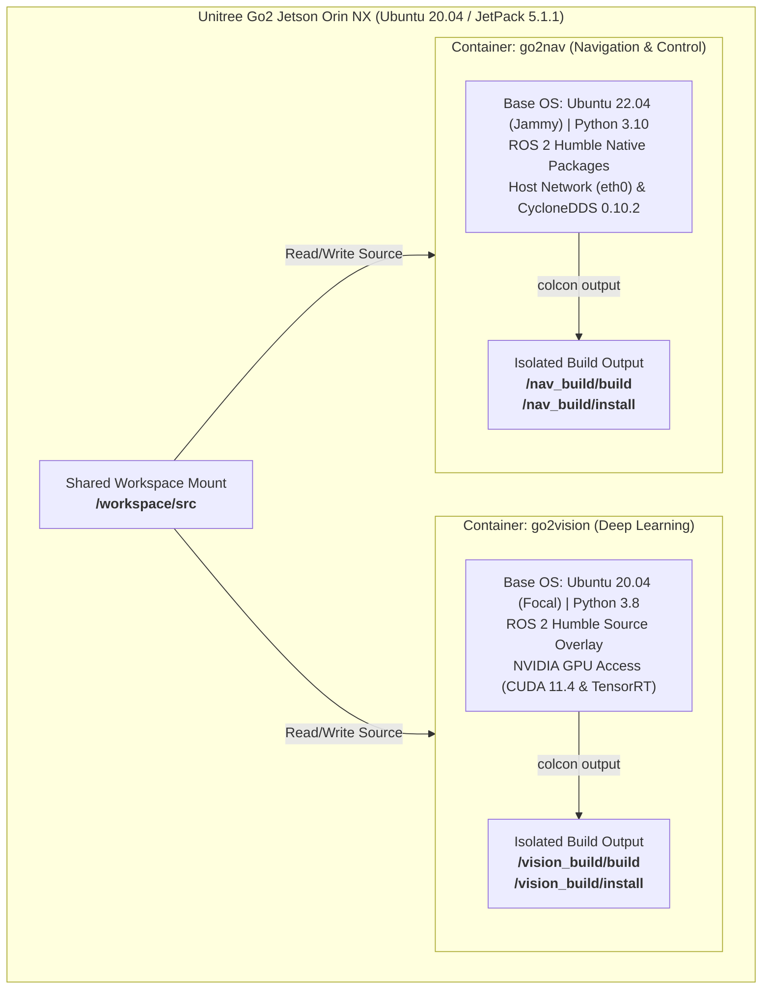
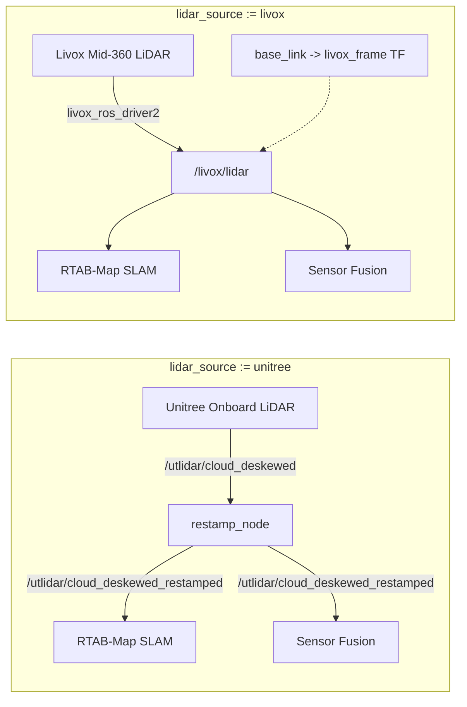

# Unitree Go2 Vision & Navigation Stack — Technical Architecture

This document provides a detailed architectural specification of the dual-container autonomous vision, mapping, and target tracking stack deployed on the **Unitree Go2 quadruped platform** powered by an **NVIDIA Jetson Orin NX**.

---

## 1. Container & Workspace Isolation Topology

To support high-throughput GPU deep-learning inference alongside low-latency ROS 2 Humble navigation and low-level C++ SDK bindings without library version conflicts, the system runtime is split across two Docker containers.

Both containers share the host directory `/workspace/src` via Docker volume mounts, but compile code into completely separate, isolated build targets (`/vision_build` and `/nav_build`) to prevent Python bytecode and package prefix corruption.



### Container Specification Comparison

| Technical Parameter | `go2vision` Container | `go2nav` Container |
|---|---|---|
| **Base OS / Image** | Ubuntu 20.04 (Focal) / `dustynv/ros:humble-ros-base-l4t-r35.3.1` | Ubuntu 22.04 (Jammy) / `arm64v8/ros:humble-ros-base` |
| **Python Version** | Python 3.8 | Python 3.10 |
| **ROS 2 Distribution** | ROS 2 Humble (Source Build Overlay) | ROS 2 Humble (Native Binaries) |
| **Hardware Access** | NVIDIA GPU (`--runtime nvidia`) | Host Network Interface (`--net=host`) |
| **Primary Workload** | YOLOv11 TensorRT inference & BoT-SORT multi-object tracking | RTAB-Map SLAM, Nav2, sensor-fusion projection, locomotion bridge |
| **Isolated Build Output** | `--build-base /vision_build/build`<br>`--install-base /vision_build/install` | `--build-base /nav_build/build`<br>`--install-base /nav_build/install` |
| **Default RMW** | `rmw_fastrtps_cpp` | `rmw_cyclonedds_cpp` (with `FastRTPS` overrides for SDK nodes) |

---

## 2. Directory Structure & Source Code Map

```text
/workspace/src/
├── go2_vision/               # GPU Deep Learning Detection Package
│   ├── config/
│   │   └── custombotsort.yaml        # BoT-SORT tracker configuration
│   ├── go2_vision/
│   │   ├── __init__.py
│   │   └── yolo_node.py              # YOLOv11 TensorRT detection node (yolo_detector)
│   ├── package.xml
│   └── setup.py
│
├── go2_nav/                  # Navigation, Locomotion & Sensor-Fusion Package
│   ├── config/
│   │   ├── explore_lite_params.yaml  # Frontier exploration configuration
│   │   ├── nav2_params.yaml          # Nav2 navigation configuration
│   │   ├── nav2_slam_params.yaml     # Nav2 + SLAM configuration
│   │   └── go2_front_calib.json      # Front camera pinhole intrinsic parameters
│   ├── go2_nav/
│   │   ├── __init__.py
│   │   ├── cameraaccess.py           # Unitree Video RPC capture & JPEG compression (cameraimg)
│   │   ├── cameraInfoPublisher.py    # Static CameraInfo publisher (camera_info_publisher)
│   │   ├── moveapicall.py            # Low-level Unitree Python SDK calls
│   │   ├── moveapinode.py            # Locomotion bridge (go2_sport_bridge)
│   │   ├── odomBroadcast.py          # TF publisher odom -> base_link (odom_broadcast)
│   │   ├── restamp_node.py           # Clock offset correction (restamp_node)
│   │   ├── follow_object_client.py   # Action client supervisor
│   │   ├── follow_object_server.py   # Action server target pursuit
│   │   └── object_tracking_fusion.py # Core 2D-to-3D sensor fusion node (object_pursuit_node)
│   ├── launch/
│   │   ├── explore_slam.launch.py    # Master SLAM + Nav2 + Frontier launch
│   │   ├── slam_explore.launch.py    # RTAB-Map SLAM bringup
│   │   ├── navigatio.launch.py       # Nav2 stack bringup
│   │   ├── detectionnavigate.launch.py # Action-based pursuit launcher
│   │   └── object_tracking.launch.py # Integrated sensor-fusion launcher
│   ├── maps/                         # Map storage directory
│   ├── package.xml
│   └── setup.py
│
├── go2_vision_msgs/          # Custom ROS 2 Interface Definitions
│   ├── action/
│   │   └── FollowObject.action       # Mission control action interface
│   ├── CMakeLists.txt
│   └── package.xml
│
└── m-explore-ros2/           # Autonomous Frontier Exploration Package
    ├── explore/              # explore_lite package
    └── map_merge/            # Multi-robot map merging utility
```

---

## 3. Subsystem Breakdown & Node Responsibilities

### 3.1 `go2_vision` Subsystem
- **Runtime Container**: `go2vision`
- **Key Node**: `yolo_detector` ([yolo_node.py](file:///home/safal/Desktop/unitreego2nav/src/go2_vision/go2_vision/yolo_node.py))
  - Subscribes to `/go2/camera/compressed`.
  - Runs TensorRT-accelerated inference using the INT8 engine `yolo26n.engine`.
  - Tracks targets using BoT-SORT ([custombotsort.yaml](file:///home/safal/Desktop/unitreego2nav/src/go2_vision/config/custombotsort.yaml)).
  - Publishes 2D bounding boxes, track IDs, and confidence scores as `vision_msgs/msg/Detection2DArray` on `/yolo/detections`.
  - Publishes annotated visual tracking frames to `/yolo/annotated_image/compressed`.

### 3.2 `go2_nav` Subsystem
- **Runtime Container**: `go2nav`
- **Key Nodes**:
  - **`cameraimg`** ([cameraaccess.py](file:///home/safal/Desktop/unitreego2nav/src/go2_nav/go2_nav/cameraaccess.py)): Connects to Unitree SDK video RPC server, captures frames, applies JPEG compression (`JPEG_QUALITY = 80`), and publishes to `/go2/camera/compressed` at 12.5 Hz.
  - **`camera_info_publisher`** ([cameraInfoPublisher.py](file:///home/safal/Desktop/unitreego2nav/src/go2_nav/go2_nav/cameraInfoPublisher.py)): Reads camera intrinsics from `go2_front_calib.json` and publishes static `sensor_msgs/msg/CameraInfo` on `/front_camera/camera_info`.
  - **`go2_sport_bridge`** ([moveapinode.py](file:///home/safal/Desktop/unitreego2nav/src/go2_nav/go2_nav/moveapinode.py)): Subscribes to `/cmd_vel_manual` and calls Unitree SDK `SportClient` API. Implements velocity safety limits ($v_x \le 0.25\text{ m/s}$, $v_y \le 0.25\text{ m/s}$, $v_{\psi} \le 0.4\text{ rad/s}$).
  - **`restamp_node`** ([restamp_node.py](file:///home/safal/Desktop/unitreego2nav/src/go2_nav/go2_nav/restamp_node.py)): Corrects the ~126-second hardware clock skew on `/utlidar/cloud_deskewed` and `/utlidar/robot_odom`, publishing clean `_restamped` topics.
  - **`odom_tf_broadcaster`** ([odomBroadcast.py](file:///home/safal/Desktop/unitreego2nav/src/go2_nav/go2_nav/odomBroadcast.py)): Broadcasts the dynamic TF transform `odom` $\rightarrow$ `base_link`.
  - **`object_pursuit_node`** ([object_tracking_fusion.py](file:///home/safal/Desktop/unitreego2nav/src/go2_nav/go2_nav/object_tracking_fusion.py)): Core integrated sensor-fusion pipeline executing pinhole 2D-to-3D projection, depth lifting from LiDAR point clouds, and target pose generation on `/goal_pose`.

---

## 4. Multi-LiDAR Sensor Pipeline Architecture

The system supports two distinct LiDAR operating modes via the launch configuration parameter `lidar_source`:



1. **Internal Unitree LiDAR**:
   - Topic: `/utlidar/cloud_deskewed_restamped`
   - Requires clock realignment via `restamp_node`.
2. **External Livox Mid-360 LiDAR**:
   - Workspace: `livox_ws` running `livox_ros_driver2` (`msg_MID360_launch.py`).
   - Topic: `/livox/lidar`
   - Frame transform: `base_to_livox_tf` static transform publisher ($x=0.05\text{m}, z=0\text{m}, \text{pitch}=0.1745\text{ rad}$).

---

## 5. 2D-to-3D Target Fusion Mathematical Model

To locate targets in 3D physical space using a 2D camera and a 3D LiDAR point cloud, the sensor fusion system projects points across coordinate frames using a calibrated pinhole camera optics model.

### 5.1 Pinhole Camera Model Projection
Given intrinsic parameters from `go2_front_calib.json`:
- Focal lengths: $(f_x, f_y)$
- Optical center (principal point): $(c_x, c_y)$

A 3D point $P_c = (X_c, Y_c, Z_c)^T$ in the camera optical coordinate frame projects to 2D image pixel coordinates $(u, v)$ as:

$$u = \frac{f_x \cdot X_c}{Z_c} + c_x$$

$$v = \frac{f_y \cdot Y_c}{Z_c} + c_y$$

### 5.2 LiDAR to Camera Coordinate Transformation
A 3D point $P_{lidar} = (X_l, Y_l, Z_l)^T$ in the LiDAR frame is transformed into the camera optical frame $P_c$ using the rotation matrix $R$ and translation vector $t$ obtained from TF transform lookups:

$$P_c = R \cdot P_{lidar} + t$$

$$P_c = \begin{bmatrix} X_c \\ Y_c \\ Z_c \end{bmatrix} = \begin{bmatrix} R_{11} & R_{12} & R_{13} \\ R_{21} & R_{22} & R_{23} \\ R_{31} & R_{32} & R_{33} \end{bmatrix} \begin{bmatrix} X_l \\ Y_l \\ Z_l \end{bmatrix} + \begin{bmatrix} t_x \\ t_y \\ t_z \end{bmatrix}$$

### 5.3 Bounding Box Filtering & Centroid Estimation
1. For each 2D YOLO detection of the target class, extract the bounding box pixel limits:
   $$\text{Box} = [u_{min}, v_{min}, u_{max}, v_{max}]$$
2. Transform the LiDAR point cloud into camera space $P_c$ and project each point to image coordinates $(u, v)$.
3. Filter points that lie inside the bounding box and within target depth bounds ($0 < Z_c \le Z_{max}$):
   $$\mathcal{S} = \left\{ P_c \ \middle|\ u_{min} \le u \le u_{max},\ v_{min} \le v \le v_{max},\ 0 < Z_c \le Z_{max} \right\}$$
4. Compute the 3D centroid of the target object in camera space:
   $$C_c = \frac{1}{|\mathcal{S}|} \sum_{P_c \in \mathcal{S}} P_c$$
5. Transform the centroid $C_c$ into the global `map` frame using TF2:
   $$C_{map} = T_{camera \to map} \cdot C_c$$
6. Publish $C_{map}$ as a `geometry_msgs/PoseStamped` message to `/goal_pose`.

---

## 6. Object Pursuit & Mission Control Layer

The pursuit architecture features two complementary control paradigms:

```text
+-----------------------------------------------------------------------------------+
|                            Mission Control Architecture                           |
|                                                                                   |
|  [Core Sensor Fusion Pipeline]             [ROS 2 Action Mission Layer]             |
|   object_pursuit_node                       follow_object_server / client         |
|   - Direct 2D-to-3D projection               - FollowObject.action interface      |
|   - Continuous /goal_pose publishing         - Mission supervisor state machine   |
+-----------------------------------------------------------------------------------+
```

### 6.1 Direct Integrated Sensor-Fusion Mode (`object_pursuit_node`)
In [object_tracking_fusion.py](file:///home/safal/Desktop/unitreego2nav/src/go2_nav/go2_nav/object_tracking_fusion.py), `object_pursuit_node` runs as a unified ROS 2 node. It synchronizes `/yolo/detections` and point cloud feeds (`/utlidar/cloud_deskewed_restamped` or `/livox/lidar`) using `ApproximateTimeSynchronizer`, performs spatial filtering, and directly outputs target goal poses.

### 6.2 ROS 2 Action Mission Layer (`FollowObject.action`)
For mission-level coordination, `follow_object_server` and `follow_object_client` implement the `FollowObject.action` interface ([FollowObject.action](file:///home/safal/Desktop/unitreego2nav/src/go2_vision_msgs/action/FollowObject.action)).

#### Mission Supervisor State Machine:
```text
  EXPLORING (Default: explore_lite driving frontiers)
      │
      │ Target detected & locked on
      ▼
   PAUSING  ──► Publish False to explore/resume (explore_lite halts)
      │
      ▼
  NAVIGATING ──► Send 3D centroid pose goal to Nav2 action server
      │
      ├─► Success ──► DWELLING (Wait 5s at standoff distance)
      └─► Timeout ──► Mark attempt failed
      │
      ▼
   RESUMING ──► Publish True to explore/resume (explore_lite resumes)
      │
      ▼
  EXPLORING (Resume frontier search)
```

---

## 7. Critical Architectural Safeguards

### 7.1 Clock Offset Mitigation (`restamp_node`)
- **Problem**: Onboard Unitree hardware topics use an un-synchronized internal clock with a **~126-second offset** relative to Jetson system time, causing immediate TF lookup timeouts.
- **Solution**: `restamp_node` intercepts `/utlidar/cloud_deskewed` and `/utlidar/robot_odom`, replaces timestamps with `node.get_clock().now()`, and publishes clean `_restamped` topics.

### 7.2 Network JPEG Compression (`cameraimg`)
- **Problem**: Uncompressed raw video streams (1920x1080) at 12.5 Hz require **~77 MB/s** bandwidth, saturating robot network interfaces.
- **Solution**: `cameraimg` compresses frames using OpenCV (`cv2.imencode`) to JPEG format (`JPEG_QUALITY = 80`), reducing payloads to **100–300 KB/s**.

### 7.3 Multi-RMW DDS Coexistence
- **Problem**: Unitree SDK bindings require `FastRTPS` (`rmw_fastrtps_cpp`), while native ROS 2 Humble packages rely on `CycloneDDS` (`rmw_cyclonedds_cpp`).
- **Solution**: Hardware bridge nodes explicitly set environment variable overrides (`RMW_IMPLEMENTATION=rmw_fastrtps_cpp`) while navigation nodes use standard `rmw_cyclonedds_cpp`.

---

## 8. System Execution Flow & Startup Sequence

System launch is managed by [start_go2.sh](file:///home/safal/Desktop/unitreego2nav/start_go2.sh) using a TMUX session (`go2_stack`).

```mermaid
gantt
    title System Startup Sequence & Execution Delays
    dateFormat s
    axisFormat %S s
    
    section Container Lifecycle
    Start Docker Containers (go2nav / go2vision) :active, c1, 0, 2s
    
    section Navigation Stack
    Explore SLAM Bringup (explore_slam.launch.py) :c2, after c1, 35s
    
    section Hardware Bridges
    Camera Bridge Start (cameraimg - 5s delay) :c3, after c1, 7s
    
    section Vision Processing
    YOLO Detector Start (yolo_detector - 10s delay) :c4, after c1, 12s
    
    section Sensor Fusion
    Object Pursuit Launch (object_tracking.launch.py - 35s delay) :c5, after c1, 37s

    section Livox LiDAR Driver
    Livox Driver Launch (msg_MID360_launch.py) :c6, after c1, 5s
```



- **0s–2s**: Host starts Docker containers `go2nav` and `go2vision`.
- **2s**: Launches RTAB-Map SLAM, Nav2, and `restamp_node` inside `go2nav`.
- **5s**: Launches Livox Mid-360 driver in `livox_ws`.
- **7s**: Launches `cameraimg` camera bridge to capture and compress video.
- **12s**: Launches `yolo_detector` inside `go2vision` container for GPU inference.
- **37s**: Launches `object_tracking.launch.py` containing `object_pursuit_node` after SLAM map and TF tree are fully initialized.
