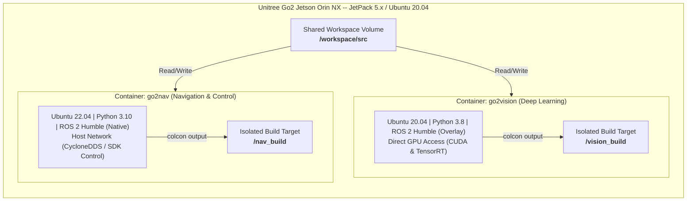

# Unitree Go2 Vision & Navigation Stack — System Architecture

This document describes the design, execution, and data architecture of the dual-container autonomous vision and navigation stack running on the **Unitree Go2 Jetson Orin NX platform**.

---

## 1. Container & Workspace Isolation Architecture

To support hardware-accelerated deep learning side-by-side with ROS 2 Humble control stacks without package conflict, the system runtime is divided into two separate Docker containers. These containers share the source repository directory (`/workspace/src`) but write to completely isolated build targets to prevent Python version and package prefix corruption.



| Container | Base OS & Python | ROS 2 Humble | Hardware Access | Primary Responsibility | Isolated Output Paths |
|---|---|---|---|---|---|
| **`go2vision`** | Ubuntu 20.04 <br> Python 3.8 | Humble source overlay | NVIDIA GPU (CUDA & TensorRT) | High-throughput YOLOv11 detector & tracker | Build: `/vision_build/build` <br> Install: `/vision_build/install` |
| **`go2nav`** | Ubuntu 22.04 <br> Python 3.10 | Humble native packages | Host Network Interface (`eth0`) | SLAM, Nav2, sensor-fusion projection, motion bridges | Build: `/nav_build/build` <br> Install: `/nav_build/install` |

---

## 2. Directory Structure & Source Code Map

The `/workspace/src` folder contains the source code packages. Recent structural updates have consolidated standalone helpers directly into the main packages:

```text
/workspace/src/
├── go2_vision/               # GPU-accelerated YOLO Node Package
│   ├── go2_vision/
│   │   ├── __init__.py
│   │   └── yolo_node.py      # ROS 2 node running TensorRT YOLOv11 tracker
│   ├── package.xml
│   └── setup.py
│
├── go2_nav/                  # Core Control, Bridges, and Sensor Fusion Package
│   ├── go2_nav/
│   │   ├── __init__.py
│   │   ├── cameraaccess.py   # Grabs video samples from Unitree SDK, compresses to JPEG, and publishes
│   │   ├── cameraInfoPublisher.py # Publishes CameraInfo parameters (Integrated)
│   │   ├── moveapicall.py    # Low-level movement calls using Unitree python bindings
│   │   ├── moveapinode.py    # Go2SportapiBridge node subscribing to /cmd_vel_manual
│   │   ├── odomBroadcast.py  # OdomTFBroadcaster publishing odom -> base_link
│   │   ├── restamp_node.py   # RestampNode correcting the 126s clock offset on lidar/odom topics
│   │   ├── follow_object_client.py  # Action client for FollowObject action (Mission Supervisor)
│   │   ├── follow_object_server.py  # Action server implementing depth projection & YOLO bounding box mapping
│   │   └── object_tracking_fusion.py # Unified tracking & depth-lifting sensor fusion node (Integrated)
│   ├── config/
│   │   ├── explore_lite_params.yaml # Frontier exploration parameters
│   │   ├── nav2_params.yaml         # Standalone navigation parameters
│   │   ├── nav2_slam_params.yaml    # Navigation with SLAM parameters
│   │   └── go2_front_calib.json     # Calibrated camera intrinsic parameters (Integrated)
│   ├── launch/
│   │   ├── explore_slam.launch.py   # Full SLAM + Nav2 + frontier exploration launch file
│   │   ├── slam_explore.launch.py   # RTAB-Map SLAM standalone launcher
│   │   ├── navigatio.launch.py      # Nav2 bringup launcher
│   │   ├── detectionnavigate.launch.py # Target follow-object navigation launch file
│   │   └── object_tracking.launch.py # Integrated launch file for transforms, camera info & tracker (Integrated)
│   ├── maps/                 # Map storage directory
│   ├── package.xml
│   └── setup.py
│
├── go2_vision_msgs/          # Custom Interfaces Package (Action and Message Definitions)
│   ├── action/
│   │   └── FollowObject.action      # ROS 2 action definition for object tracking missions
│   ├── CMakeLists.txt
│   └── package.xml
│
└── m-explore-ros2/           # Frontier-based Exploration Package (explore_lite)
    ├── explore/              # explore_lite package source directory
    ├── explore_lite_msgs/    # Messages for explore_lite
    └── map_merge/            # Multi-robot map merging utility
```

---

## 3. Node Architecture & Package Responsibilities

### 3.1 `go2_vision`
- **Container**: `go2vision` (needs access to CUDA/TensorRT GPU hardware acceleration)
- **Key Node**: `yolo_camera_node` ([yolo_node.py](file:///home/safal/Desktop/unitreego2nav/src/go2_vision/go2_vision/yolo_node.py))
  - Subscribes to `/go2/camera/compressed`.
  - Runs TensorRT-accelerated inference using the local engine `yolo26n.engine`.
  - Tracks targets (e.g. `person`) using BoT-SORT and publishes localized 2D bounding boxes as `vision_msgs/msg/Detection2DArray` on the `/yolo/detections` topic.
  - Publishes annotated tracking feed to `/yolo/annotated_image/compressed`.

### 3.2 `go2_nav`
- **Container**: `go2nav` (runs control loops, TF tree transforms, and links with CycloneDDS)
- **Key Nodes**:
  - **`cameraimg`** ([cameraaccess.py](file:///home/safal/Desktop/unitreego2nav/src/go2_nav/go2_nav/cameraaccess.py)): Connects to the Unitree SDK's video RPC service to capture raw camera frames. Compresses them into JPEG format (quality = 80) to save bandwidth and publishes them on `/go2/camera/compressed` at 12.5 Hz.
  - **`camera_info_publisher`** ([cameraInfoPublisher.py](file:///home/safal/Desktop/unitreego2nav/src/go2_nav/go2_nav/cameraInfoPublisher.py)): **[Consolidated]** Publishes static, calibrated camera parameters (`CameraInfo`) on `/front_camera/camera_info` based on `go2_front_calib.json` calibration intrinsics.
  - **`go2_Sportapi_bridge`** ([moveapinode.py](file:///home/safal/Desktop/unitreego2nav/src/go2_nav/go2_nav/moveapinode.py)): Connects to the Unitree Go2 SDK `SportClient` API over `eth0`. Converts incoming velocity commands from `/cmd_vel_manual` into direct leg locomotion calls (`Move(vx, vy, vyaw)`). Implements safety velocity limits clamped at `vx = 0.25 m/s`, `vy = 0.25 m/s`, `vyaw = 0.4 rad/s`.
  - **`restamp_node`** ([restamp_node.py](file:///home/safal/Desktop/unitreego2nav/src/go2_nav/go2_nav/restamp_node.py)): Catches raw `/utlidar/cloud_deskewed` (LiDAR) and `/utlidar/robot_odom` (Odometry) topics, overrides headers with current ROS clock time, and publishes them as `_restamped` topics. This fixes the hardware-level ~126-second offset that causes ROS TF lookup timeouts.
  - **`odom_tf_broadcaster`** ([odomBroadcast.py](file:///home/safal/Desktop/unitreego2nav/src/go2_nav/go2_nav/odomBroadcast.py)): Subscribes to the restamped `/utlidar/robot_odom_restamped` and publishes the TF transformation `odom` $\rightarrow$ `base_link`.
  - **`object_pursuit_node`** ([object_tracking_fusion.py](file:///home/safal/Desktop/unitreego2nav/src/go2_nav/go2_nav/object_tracking_fusion.py)): **[Unified Sensor-Fusion Node]** A standalone node combining YOLO 2D tracking inputs, camera calibration info, and LiDAR point clouds to project and calculate `/goal_pose` directly.

### 3.3 `go2_vision_msgs`
- **Build Targets**: Built in both containers (compiled into both `/vision_build` and `/nav_build`)
- **Action Interface**: [FollowObject.action](file:///home/safal/Desktop/unitreego2nav/src/go2_vision_msgs/action/FollowObject.action)
  - **Goal**: `string target_class`
  - **Result**: `bool target_lost`, `geometry_msgs/PoseStamped final_pose`, `string message`
  - **Feedback**: `geometry_msgs/PoseStamped current_pose`, `bool locked_on`, `int32 consecutive_hits`

### 3.4 `explore_lite`
- **Container**: `go2nav`
- **Function**: Frontier-based exploration package monitoring `/map`. Selects boundaries between known and unknown cells (frontiers), plans paths to travel to them using Nav2, and publishes status feedback. The supervisor can pause/resume goal generation via the `explore/resume` topic (`std_msgs/Bool`).

---

## 4. 2D-to-3D Target Fusion Mathematical Model

To track physical targets in 3D using a monocular camera and a LiDAR point cloud, the sensor fusion system projects points between coordinate frames using a calibrated pinhole camera model.


*Figure 2: Coordinate geometry mapping LiDAR point clouds onto 2D image coordinates using camera calibration parameters.*

### 4.1 Pinhole Camera Model
Given camera intrinsic parameters from [go2_front_calib.json](file:///home/safal/Desktop/unitreego2nav/src/go2_nav/config/go2_front_calib.json):
- Focal length: $(f_x, f_y)$
- Principal point (center of projection): $(c_x, c_y)$

A 3D point $P_c = (X_c, Y_c, Z_c)^T$ in the camera optical frame projects to image pixel coordinates $(u, v)$ as:

$$u = \frac{f_x \cdot X_c}{Z_c} + c_x$$

$$v = \frac{f_y \cdot Y_c}{Z_c} + c_y$$

### 4.2 LiDAR to Camera Transformation
The raw 3D point cloud $P_{lidar}$ in the LiDAR frame is transformed into the camera optical frame $P_c$ using the relative rotation matrix $R$ and translation vector $t$ obtained from the TF transform lookup:

$$P_c = R \cdot P_{lidar} + t$$

$$P_c = \begin{bmatrix} X_c \\ Y_c \\ Z_c \end{bmatrix} = \begin{bmatrix} R_{11} & R_{12} & R_{13} \\ R_{21} & R_{22} & R_{23} \\ R_{31} & R_{32} & R_{33} \end{bmatrix} \begin{bmatrix} X_{lidar} \\ Y_{lidar} \\ Z_{lidar} \end{bmatrix} + \begin{bmatrix} t_x \\ t_y \\ t_z \end{bmatrix}$$

### 4.3 Bounding Box Filtering & Centroid Estimation
1. For each 2D YOLO detection of the target class, we retrieve the bounding box:
   $$\text{Box} = [u_{min}, v_{min}, u_{max}, v_{max}]$$
2. Loop over the transformed 3D points $P_c$, projecting each to pixel space $(u, v)$ using the pinhole model.
3. Filter points that fall inside the bounding box and lie within target depth limits (e.g. $Z_c > 0$ and $Z_c \le 4.0\text{m}$):
   $$\mathcal{S} = \left\{ P_c \ \middle|\ u_{min} \le u \le u_{max},\ v_{min} \le v \le v_{max},\ 0 < Z_c \le Z_{max} \right\}$$
4. Compute the 3D centroid in the camera frame:
   $$C_c = \frac{1}{|\mathcal{S}|} \sum_{P_c \in \mathcal{S}} P_c$$
5. Using TF2, transform the centroid $C_c$ from `camera_link` to `map` frame coordinates:
   $$C_{map} = T_{camera \to map} \cdot C_c$$
6. Publish $C_{map}$ as a `geometry_msgs/PoseStamped` message to the `/goal_pose` topic.

---

## 5. Architectural Constraints & Safeguards

### 5.1 Clock Offset Mitigation (`restamp_node`)
The hardware-level outputs from Unitree's built-in sensors (`/utlidar/robot_odom` and `/utlidar/cloud_deskewed`) use the internal system clock of the Unitree processor, which exhibits a persistent offset of **~126 seconds** relative to the Jetson Orin system time.
- **Problem**: ROS 2 message synchronization and TF2 buffer lookups immediately time out if messages are stamped 126 seconds apart.
- **Fix**: The `restamp_node` intercepts these feeds, overrides their stamps with `node.get_clock().now()`, and publishes them as `_restamped` topics.

### 5.2 Network Bandwidth Optimization (JPEG Compression)
A raw uncompressed high-resolution frame (1920x1080) requires roughly **6.22 MB** of memory. Transmitting raw images at 12.5 Hz requires sustained bandwidths upwards of **77 MB/s**, which saturates the robot's network interfaces, causing massive latency bottlenecks.
- **Fix**: The `cameraimg` node uses OpenCV (`cv2.imencode`) to compress frames to JPEG (`JPEG_QUALITY = 80`) before transmission, dropping frame sizes down to **100–300 KB** (a 20x to 60x reduction) and maintaining real-time latency.

### 5.3 DDS Middleware Separation (FastRTPS vs CycloneDDS)
The Unitree Go2 SDK's internal bindings rely on **FastRTPS** (`rmw_fastrtps_cpp`). However, native ROS 2 Humble packages inside the `go2nav` container default to **CycloneDDS** (`rmw_cyclonedds_cpp`). Running both DDS interfaces simultaneously in a single process causes compilation/runtime errors or lost packets.
- **Fix**: The custom hardware bridge nodes (`cameraimg` and `go2_sport_bridge`) explicitly set `RMW_IMPLEMENTATION=rmw_fastrtps_cpp` environment variable overrides to talk to the physical robot SDK, while other navigation/exploration nodes run on standard `rmw_cyclonedds_cpp`.
- **Command Override**:
  ```bash
  RMW_IMPLEMENTATION=rmw_fastrtps_cpp ros2 run go2_nav go2_sport_bridge
  RMW_IMPLEMENTATION=rmw_fastrtps_cpp ros2 run go2_vision cameraimg
  ```

---

## 6. Execution Flow Control

We orchestrate the staggered startup using tmux configuration scripts inside the container environment. The launch schedule is divided as follows:

```mermaid
gantt
    title Startup Schedule (staggered delay)
    dateFormat  s
    axisFormat %S s
    
    section Host Containers
    Docker Start (go2nav/go2vision) :active, c1, 0, 2s
    
    section Nav stack
    Explore Slam Launch (explore_slam.launch.py) :c2, after c1, 35s
    
    section Hardware Bridges
    Camera Access Run (cameraimg, FastRTPS) :c3, after c1, 10s
    
    section Vision Stack
    YOLO Node Run (yolo_detector, FastRTPS) :c4, after c1, 15s
    
    section Sensor Fusion
    Object Pursuit Launch (object_tracking.launch.py) :c5, after c1, 40s
```



- **0s - 2s**: Host launches Docker containers `go2nav` and `go2vision`.
- **2s**: Launches `explore_slam.launch.py` inside `go2nav` to initialize RTAB-Map SLAM and Nav2.
- **7s**: Launches the `cameraimg` camera bridge to capture and compress images.
- **12s**: Launches `yolo_detector` in the `go2vision` container to start 2D detection.
- **37s**: Launches `object_tracking.launch.py` containing the `object_pursuit_node`. The generous delay ensures SLAM maps, TF trees, and YOLO frames are fully initialized before tracking centroids are published.
