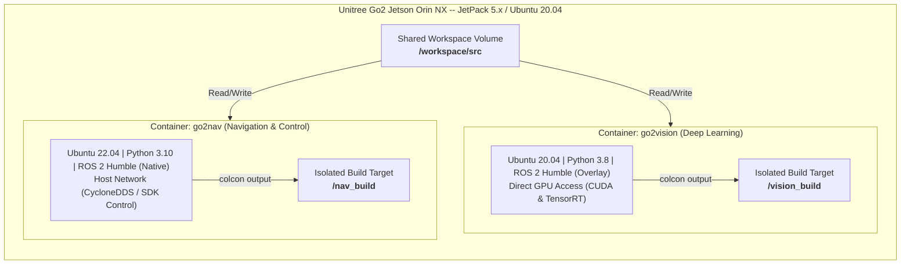

# Unitree Go2 Vision & Navigation Stack — System Architecture & Workspace Reference

This document outlines the dual-container system architecture deployed on the **Unitree Go2 Jetson platform**, detailing the package structure inside the source space (`/workspace/src`), how the components are linked together via ROS 2, and the execution workflow.

---

## 1. Container & Workspace Isolation Architecture

To run hardware-accelerated deep learning alongside modern software libraries without library conflicts, the runtime is split between two separate Docker containers. These containers share the exact same raw source tree under `/workspace/src` but keep their build and install directories completely isolated.



| Container | Base OS & Python | ROS 2 Humble Build | Hardware Access | Primary Responsibility | Target Build Paths |
|---|---|---|---|---|---|
| **`go2vision`** | Ubuntu 20.04 <br> Python 3.8 | Built from source overlay | NVIDIA GPU (CUDA, TensorRT) | High-throughput AI inference & object tracking | Build: `/vision_build/build` <br> Install: `/vision_build/install` |
| **`go2nav`** | Ubuntu 22.04 <br> Python 3.10 | Native package installation | Host Network Interface (`eth0`) | State supervisor, sensor fusion, SLAM, Nav2, motion controls | Build: `/nav_build/build` <br> Install: `/nav_build/install` |

---

## 2. Directory Structure & Source Code Map

All project packages are located in the `/workspace/src/` folder. Below is the tree layout of `/workspace/src/` and the description of each package.

```text
/workspace/src/
├── follow_object_client.py   # Top-level action client test script (duplicating go2_nav/follow_object_client.py)
├── follow_object_server.py   # Top-level action server test script (duplicating go2_nav/follow_object_server.py)
│
├── go2_vision/               # GPU-accelerated YOLO Node Package
│   ├── go2_vision/
│   │   ├── __init__.py
│   │   └── yolo_node.py      # ROS 2 node running TensorRT YOLOv11 tracker
│   ├── package.xml
│   └── setup.py
│
├── go2_nav/                  # Core Control, Bridges, and Sensor Fusion Package
│   ├── go2_nav/
│   │   ├── __init__.py
│   │   ├── cameraaccess.py   # Grabs video samples from Unitree SDK, compresses to JPEG, and publishes
│   │   ├── cameraInfoPublisher.py # Publishes CameraInfo parameters on /front_camera/camera_info (Integrated)
│   │   ├── moveapicall.py    # Low-level movement calls using Unitree python bindings
│   │   ├── moveapinode.py    # Go2SportapiBridge node subscribing to /cmd_vel_manual
│   │   ├── odomBroadcast.py  # OdomTFBroadcaster publishing odom -> base_link
│   │   ├── restamp_node.py   # RestampNode correcting the 126s clock offset on lidar/odom topics
│   │   ├── follow_object_client.py  # Action client for FollowObject action (Mission Supervisor)
│   │   ├── follow_object_server.py  # Action server implementing depth projection & YOLO bounding box mapping
│   │   └── object_tracking_fusion.py # Unified tracking & depth-lifting sensor fusion node (Integrated)
│   ├── config/
│   │   ├── explore_lite_params.yaml # Frontier exploration parameters
│   │   ├── nav2_params.yaml         # Standalone navigation parameters
│   │   ├── nav2_slam_params.yaml    # Navigation with SLAM parameters
│   │   └── go2_front_calib.json     # Calibrated camera intrinsic parameters (Integrated)
│   ├── launch/
│   │   ├── explore_slam.launch.py   # Full SLAM + Nav2 + frontier exploration launch file
│   │   ├── slam_explore.launch.py   # RTAB-Map SLAM standalone launcher
│   │   ├── navigatio.launch.py      # Nav2 bringup launcher
│   │   ├── detectionnavigate.launch.py # Target follow-object navigation launch file
│   │   └── object_tracking.launch.py # Integrated launch file for transforms, camera info & tracker (Integrated)
│   ├── maps/                 # Map storage directory
│   ├── package.xml
│   └── setup.py
│
├── go2_vision_msgs/          # Custom Interfaces Package (Action and Message Definitions)
│   ├── action/
│   │   └── FollowObject.action      # ROS 2 action definition for object tracking missions
│   ├── CMakeLists.txt
│   └── package.xml
│
└── m-explore-ros2/           # Frontier-based Exploration Package (explore_lite)
    ├── explore/              # explore_lite package source directory
    ├── explore_lite_msgs/    # Messages for explore_lite
    └── map_merge/            # Multi-robot map merging utility
```

---

## 3. Package Descriptions & Responsibilities

### 1. `go2_vision`
* **ROS Package Name**: `go2_vision`
* **Target Container**: `go2vision` (needs access to CUDA/TensorRT GPU hardware acceleration)
* **Key Script**:
  * [yolo_node.py](file:///home/safal/Desktop/unitreego2nav/src/go2_vision/go2_vision/yolo_node.py): Instantiates `yolo_camera_node`. Subscribes to `/go2/camera/compressed`. Runs TensorRT-accelerated inference using the local engine `yolo26n.engine`. Locks onto a target class (e.g. `person`), tracks it using BoT-SORT, and publishes the localized 2D bounding boxes as `vision_msgs/msg/Detection2DArray` on the `/yolo/detections` topic. Also publishes the annotated visual feedback stream on `/yolo/annotated_image/compressed`.

### 2. `go2_nav`
* **ROS Package Name**: `go2_nav`
* **Target Container**: `go2nav` (runs control loops, TF tree transforms, and links with CycloneDDS)
* **Key Scripts**:
  * [cameraaccess.py](file:///home/safal/Desktop/unitreego2nav/src/go2_nav/go2_nav/cameraaccess.py): Instantiates the `cameraimg` node. Communicates with the Unitree SDK's custom video RPC service via `VideoClient` to grab raw camera frames. Compresses them into JPEG format (using `JPEG_QUALITY = 80` to restrict bandwidth usage to ~100–300 KB per frame) and publishes them on `/go2/camera/compressed` at 12.5 Hz.
  * [cameraInfoPublisher.py](file:///home/safal/Desktop/unitreego2nav/src/go2_nav/go2_nav/cameraInfoPublisher.py): Instantiates the `camera_info_publisher` node. Publishes static, calibrated camera parameters (`CameraInfo`) on `/front_camera/camera_info` at 30 Hz based on the local JSON config file (`go2_front_calib.json`).
  * [moveapinode.py](file:///home/safal/Desktop/unitreego2nav/src/go2_nav/go2_nav/moveapinode.py): Instantiates the `go2_Sportapi_bridge` node. Connects to the Unitree Go2 SDK `SportClient` over the local network interface. Subscribes to the `/cmd_vel_manual` topic and converts incoming velocity commands into direct leg motion SDK calls (`Move(vx, vy, vyaw)`). Implements safety velocity limit clamping.
  * [restamp_node.py](file:///home/safal/Desktop/unitreego2nav/src/go2_nav/go2_nav/restamp_node.py): Instantiates `restamp_node`. A crucial utility that catches `/utlidar/cloud_deskewed` (LiDAR) and `/utlidar/robot_odom` (Odometry) and overwrites their timestamps with current ROS clock time. This solves a hardware-specific ~126-second clock offset that would otherwise break ROS 2 TF lookups and synchronization filters.
  * [odomBroadcast.py](file:///home/safal/Desktop/unitreego2nav/src/go2_nav/go2_nav/odomBroadcast.py): Instantiates `odom_tf_broadcaster`. Subscribes to the restamped `/utlidar/robot_odom_restamped` topic and publishes the TF transformation `odom` $\rightarrow$ `base_link`.
  * [follow_object_server.py](file:///home/safal/Desktop/unitreego2nav/src/go2_nav/go2_nav/follow_object_server.py): Instantiates the `follow_object_server` Action Server. It manages sensor-fusion by subscribing to camera parameters (`/front_camera/camera_info`), 2D bounding boxes (`/yolo/detections`), and point cloud data (`/utlidar/cloud_deskewed_restamped`). It projects 3D point cloud points onto the 2D camera image using a pinhole model, isolates the lidar points falling within the YOLO bounding box, computes their 3D centroid, and transforms this target location into a `map`-frame `PoseStamped` which it publishes to `/goal_pose`.
  * [follow_object_client.py](file:///home/safal/Desktop/unitreego2nav/src/go2_nav/go2_nav/follow_object_client.py): Instantiates the `mission_supervisor_node` Action Client. Sends goals (e.g. track `person`) to `follow_object_server` and handles retry loops and status feedback.
  * [object_tracking_fusion.py](file:///home/safal/Desktop/unitreego2nav/src/go2_nav/go2_nav/object_tracking_fusion.py): Instantiates `object_tracking_fusion`. A unified standalone node combining YOLO 2D tracking inputs, calibrated CameraInfo parameters, and LiDAR point clouds to directly estimate and publish `/goal_pose` without request cycles.

### 3. `go2_vision_msgs`
* **ROS Package Name**: `go2_vision_msgs`
* **Target Container**: Built in both containers (compiled into both `/vision_build` and `/nav_build`)
* **Key Files**:
  * [FollowObject.action](file:///home/safal/Desktop/unitreego2nav/src/go2_vision_msgs/action/FollowObject.action): Defines the action interface:
    * **Goal**: `string target_class`
    * **Result**: `bool target_lost`, `geometry_msgs/PoseStamped final_pose`, `string message`
    * **Feedback**: `geometry_msgs/PoseStamped current_pose`, `bool locked_on`, `int32 consecutive_hits`

### 5. `m-explore-ros2`
* **ROS Package Name**: `explore_lite`
* **Target Container**: `go2nav`
* **Key Function**: Runs autonomous frontier exploration. It monitors the occupancy grid map (`/map`) generated by RTAB-Map SLAM, calculates boundaries between known and unknown areas (frontiers), plans trajectories to travel to these frontiers using Nav2, and exposes a `/explore/resume` topic to pause/resume the exploration.

---

## 4. System-Wide Data Flow & Node Linking

The nodes in this stack interact over the ROS 2 network using standard topics, actions, and the TF transform tree. The diagram below details the end-to-end data pipeline.

```mermaid
flowchart TD
    %% Define Containers & Nodes
    subgraph HW ["Unitree Go2 Hardware Services"]
        CamSample["Camera Feed (video RPC)"]
        LiDARRaw["Lidar /utlidar/cloud_deskewed"]
        OdomRaw["Odom /utlidar/robot_odom"]
        MotionSDK["Unitree Sport SDK API"]
    end

    subgraph go2vision_container ["go2vision Container"]
        YoloNode["yolo_camera_node<br><i>go2_vision</i>"]
    end

    subgraph go2nav_container ["go2nav Container"]
        CamAccess["cameraimg<br><i>go2_nav</i>"]
        Restamp["restamp_node<br><i>go2_nav</i>"]
        OdomTF["odom_tf_broadcaster<br><i>go2_nav</i>"]
        CamInfoPub["camera_info_publisher<br><i>go2_nav</i>"]
        
        FObjectServer["follow_object_server<br><i>go2_nav</i>"]
        FObjectClient["mission_supervisor_node<br><i>go2_nav</i>"]
        
        SLAM["rtabmap<br><i>rtabmap_slam</i>"]
        Laserscan["pointcloud_to_laserscan<br><i>pointcloud_to_laserscan</i>"]
        ExploreLite["explore_node<br><i>explore_lite</i>"]
        Nav2["Nav2 Stack<br><i>nav2_bringup</i>"]
        SportBridge["go2_Sportapi_bridge<br><i>go2_nav</i>"]
    end

    %% Connections
    CamSample -->|video RPC| CamAccess
    CamAccess -->|/go2/camera/compressed| YoloNode
    
    YoloNode -->|/yolo/detections<br>[Detection2DArray]| FObjectServer
    YoloNode -.->|/yolo/annotated_image/compressed| RViz(["RViz Visualizer"])
    
    CamInfoPub -->|/front_camera/camera_info| FObjectServer
    
    LiDARRaw --> Restamp
    OdomRaw --> Restamp
    
    Restamp -->|/utlidar/robot_odom_restamped<br>[Odometry]| OdomTF
    Restamp -->|/utlidar/cloud_deskewed_restamped<br>[PointCloud2]| Laserscan
    Restamp -->|/utlidar/cloud_deskewed_restamped<br>[PointCloud2]| SLAM
    Restamp -->|/utlidar/cloud_deskewed_restamped<br>[PointCloud2]| FObjectServer
    
    OdomTF -->|TF: odom -> base_link| SLAM
    OdomTF -->|TF: odom -> base_link| FObjectServer
    
    SLAM -->|TF: map -> odom| Nav2
    SLAM -->|/map<br>[OccupancyGrid]| ExploreLite
    
    Laserscan -->|/scan| Nav2
    
    ExploreLite -->|NavigateToPose Action Goal| Nav2
    
    FObjectClient -->|FollowObject Action Goal| FObjectServer
    FObjectServer -->|/goal_pose<br>[PoseStamped]| Nav2
    FObjectServer -->|Action Feedback| FObjectClient
    
    Nav2 -->|/cmd_vel_manual| SportBridge
    SportBridge -->|Move commands| MotionSDK
    
    style HW fill:#f9f,stroke:#333,stroke-width:2px
    style go2vision_container fill:#bbf,stroke:#333,stroke-width:2px
    style go2nav_container fill:#bfb,stroke:#333,stroke-width:2px
```

---

## 5. Architectural Safeguards & Critical Configuration Details

### 1. Clock Offset Realignment (`restamp_node`)
The hardware-level outputs from Unitree's built-in sensors (`/utlidar/robot_odom` and `/utlidar/cloud_deskewed`) use the internal system clock of the Unitree processor, which exhibits a persistent offset of **~126 seconds** relative to the Jetson Orin system time.
* **Why this is critical**: ROS 2's message synchronization (`ApproximateTimeSynchronizer`) and TF2 buffer lookups will immediately fail with time-out errors if they attempt to match messages stamped 126 seconds apart.
* **Fix**: The `restamp_node` intercepts these feeds, overrides their stamps with `node.get_clock().now()`, and publishes them as `_restamped` topics.

### 2. Bandwidth Management (Compressed vs Raw Images)
A raw uncompressed high-resolution frame (e.g. 1920x1080) requires roughly **6.22 MB** of memory. Transmitting raw images at 12.5 Hz requires sustained bandwidths upwards of **77 MB/s**, which easily saturates the robot's network interfaces, causing massive latency bottlenecks (often up to 10–20 seconds lag).
* **Fix**: The `cameraimg` node uses OpenCV (`cv2.imencode`) to compress frames to JPEG (`JPEG_QUALITY = 80`) before transmission, dropping frame sizes down to **100–300 KB** (a 20x to 60x reduction) and maintaining real-time latency.

### 3. RMW Context Separation (FastRTPS vs CycloneDDS)
The robot's internal SDK architecture relies on its own custom DDS setup which uses **FastRTPS** (`rmw_fastrtps_cpp`). However, the native ROS 2 Humble packages inside the `go2nav` container use **CycloneDDS** (`rmw_cyclonedds_cpp`) as their default Middleware.
* **Problem**: Nodes that directly link against the physical Unitree SDK library (e.g., `cameraimg` and `go2_sport_bridge`) will conflict with CycloneDDS, causing compilation/runtime errors or lost packets.
* **Fix**: The custom bridge nodes explicitly set `os.environ["RMW_IMPLEMENTATION"] = "rmw_fastrtps_cpp"` at start, or must be run with the environment variable override prefixed:
  ```bash
  RMW_IMPLEMENTATION=rmw_fastrtps_cpp ros2 run go2_nav go2_sport_bridge
  RMW_IMPLEMENTATION=rmw_fastrtps_cpp ros2 run go2_vision cameraimg
  ```

---


